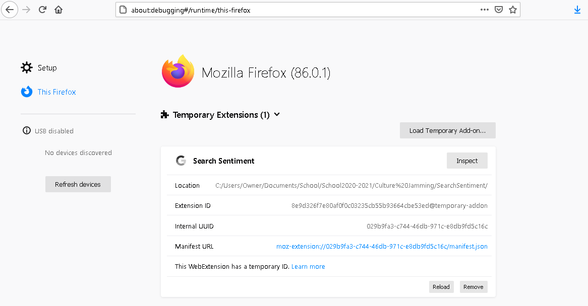

# SearchSentiment
Sentiment analyzer for AI generated searches, specifically Google Search

<!-- ABOUT THE PROJECT -->
## About The Project

This project is addressing the bias, lack of representation, and misrepresentation of minorities (specifically black people and culture) in AI. These issues range from healthcare, prison systems, image matching, speech, and more popularly facial recognition. 

This project focuses on AI search result generation bias in the form of a Firefox addon. The goal of this tool is to understand and reveal the hidden impact of AI and what type of sentiment (analyzed numerically) that it produces when being used. Its focus is on Google Search and the results / sentiment scores that it gives for various inputs. Sentiment analysis is done with the Node.js package [sentiment](https://www.npmjs.com/package/sentiment) which uses the [AFINN-165](https://github.com/words/afinn-165) wordlist on the search query results to generate a score based on the words used. A higher score is regarded as more optimisitc, hopeful, and positive. On the contrary, a lower score is regarded as more pessimstic and negative. 

<!-- GETTING STARTED -->
## Getting Started

In order to use this addon, do the following steps:
1. Click the green Code button and select "Download zip" 
2. Extract the files to a location of your choice (ie Desktop)
3. Open Firefox, go to: [about:debugging](about:debugging#/runtime/this-firefox), and click "This Firefox"
4. Click "Load Temporary Add-on"

5. Double click any file in the extracted folder
6. Go to [Google Search](https://www.google.com/) and search any input (ie "men", "business", or culture") 

## Example Usage

This is an example of how the addon works. All searches (besides the initial one) are automatic

In order to disable the addon, repeat step 3 and click Remove

<!-- ROADMAP -->
## Roadmap
When initially starting this project, I attempted to use Node.js and Express to make queries to Google. However, extracting the data became an issue as well as the potential for IP blocking by Google. As a result, I switched to an addon such that the search querying would be done by the user and not server-side. This allows a more interactive approach and removes the risk of IP blocking / the need for proxies. 

Future goals would be to include more options when searching (ie rather than just adding "black" and "white" to the input query, ideally one could customize the addition words to be any word such as "old", "LGBTQ", "Italian"). This would give the user more freedom to discover the inherit bias / sentiment of Google search results. 

Currently, the add-on navigates to Page 3 of the Google Search results in order to avoid ads, dictionaries, and company websites. In the future, it may be useful to explore different pages of the search results as well as using the addon from different locations (ie using a VPN) to see if we get the same findings due to Google's search engine personalization. 

Other potential objectives would be to create a popup for the add-on so that it can be enabled, disabled, and customized. Using other sentiment analyzers such as ml5's [Sentiment](https://ml5js.org/reference/api-Sentiment/) based on AI could also lead to further discoveries and comparisons. 
