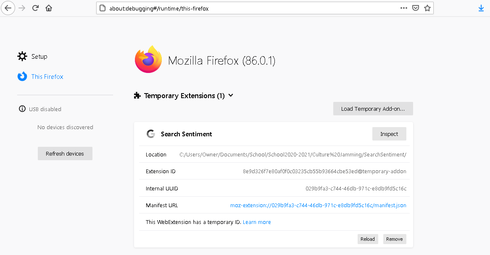

# SearchSentiment
Sentiment analyzer for AI generated searches, specifically Google Search

<!-- ABOUT THE PROJECT -->
## About The Project

This project is addressing the bias, lack of representation, and misrepresentation of minorities (specifically black people and culture) in AI. These issues range from healthcare, prison systems, image matching, speech, and more popularly facial recognition. 

This project focuses on AI search result generation bias in the form of a Firefox addon. The goal of this tool is to understand and reveal the hidden impact of AI and what type of sentiment (analyzed numerically) that it produces when being used. Its focus is on Google Search and the results / sentiment scores that it gives for various inputs. 

<!-- GETTING STARTED -->
## Getting Started

In order to use this addon, do the following steps:
1. Click the green Code button and select "Download zip" 
2. Extract the files to a location of your choice (ie Desktop)
3. Open Firefox and go to: [about:debugging](about:debugging#/runtime/this-firefox)
4. Click "This Firefox", "Load Temporary Add-on"

5. Double click any file in the extracted folder
6. Go to [Google Search](https://www.google.com/) and search any input (ie "men") 

## Example Usage

This is an example of how the addon works. All searches (besides the initial one) are automatic

